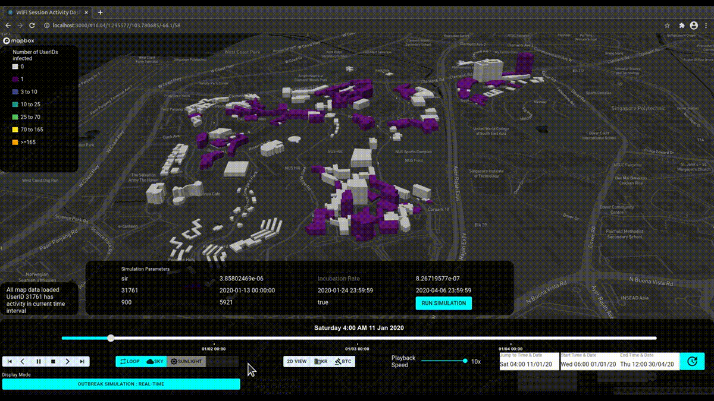

# Cofi: A Data Warehouse of Wi-Fi Sessions for Contact Tracing and Outbreak Investigation



To better prepare for the emergence and re-emergence of coronavirus epidemics,
we seek to leverage on the availability of common existing digital
infrastructure such as the increasingly ubiquitous Wi-Fi networks that can be
readily activated to assist in large-scale contact tracing. 

This project implements an experimental data warehouse of Wi-Fi sessions for
contact tracing and disease outbreak investigation on a large local university
campus in Singapore.

## Data

This project focuses on analysing Wifi log sessions provided by the IT
department of a large local university in Singapore. For more information about
the data and data processing routines please see the [data
README.md](./src/agens/data/README.md) file.

## Repository structure

`docs`
> This folder contains project documentation.

`analysis`
> Relevant analysis are included here. Each analyst is
> alocated a sub-directory.

`src`
> Source-code to support project implementation, data wrangling, visualization
> and analysis. More info below.

`bin`
> Contains executables and routines for managing different parts of the
> project.

## Source-code

The code is split in different parts as following:


`src/agens`
> Contains the data-warehouse. It includes prepopulated tables and more
> detailed information about the data. The data-warehouse can be started with
> the Dockerfile provided.

`src/airflow`
> Provides the ETL tasks. The tasks are defined as Airflow DAGs. Python
> dependencies to assist with the tasks can be added to requirements.txt. The
> dependencies are installed when the container is created. To install new
> dependencies when the container is up, it is possible to do it interactively
> with `docker exec`, but make sure to document it in the requirements file.

`src/viz`
> Contains the analytics application which consist of front- and backend
> servers. The frontend application provides three different functions: crowd
> sensing, contact tracing and disease simulator (pictured at the top). The
> application can be started with as a Docker container using the Dockerfile
> provided.

## Development environment

It is possible to set up a development environment via Docker containers and
environment variables.

```sh
> docker-compose up -d
```

This will spin-off a fresh instance of the data warehouse. Configuration
parameters should be tweaked in the environment file `.env` which should be
based on `.env-dev`. After successful container initialization, you will find
the database available in `$AGENS_PORT`, the Airflow UI in `$AIRFLOW_PORT` and
the frontend application in `$WEBSERVER_PORT`. Both Airflow and the
web-application can be accessed from the browser.

`docker-compose.yml`
> This spins up the required Docker containers for this project.

`.env-dev`
> Environment variables. For local deployment, the recommendation is to copy
> this file to `.env` and tweak as required while maintaining an authoritative
> environment file.
