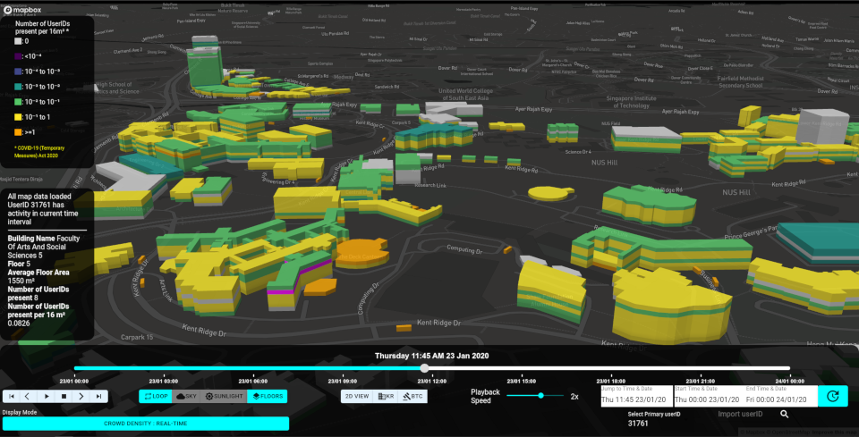
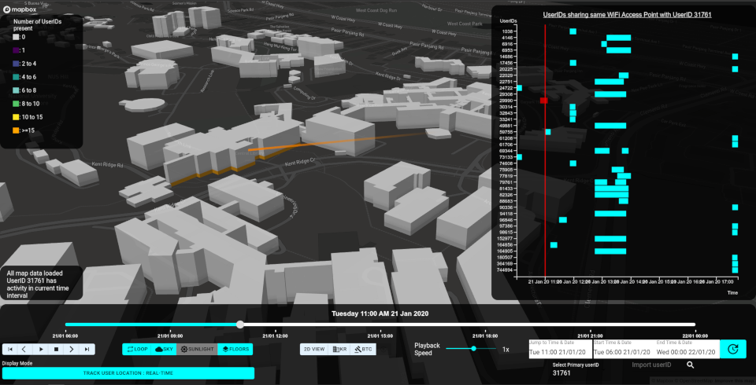
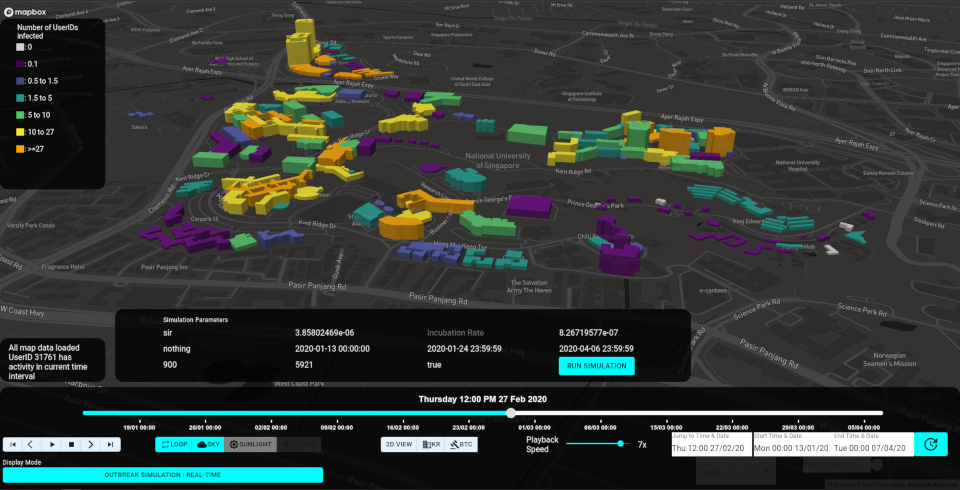

# Visualization, API and analytics services

This section consits of three components, a frontend and two backend servers.

All of the components can be jointly deployed with Docker. See the [project
README](../../README.md) for further information. It is important to notice
that deployment is geared towards development. At this point it would not be
recommended to use this application for production without proper adjustments.

   
  
  

Access to the application is mediated by `nginx` HTTP server, the configuration of
which is available in [nginx.conf](./nginx.conf). 

The frontend application is built with React and Mapbox-GL. React facilitates
development by allowing a modular design. Mapbox-GL provides the GIS
capabilities including 3D.

There are two backend servers. The python backend provides most of the API.
Basic datawarehouse queries are mediated with the python backend. It is a
Tornado backend server. It is able to load 2.5 months of data in about 30
seconds.  The julia backend handles the simulation which is available in a
separate repository which will be made available once it is more mature and
stable. Eventually, the julia backend could replace the python backend to
reduce the amount of servers and code to maintain.
